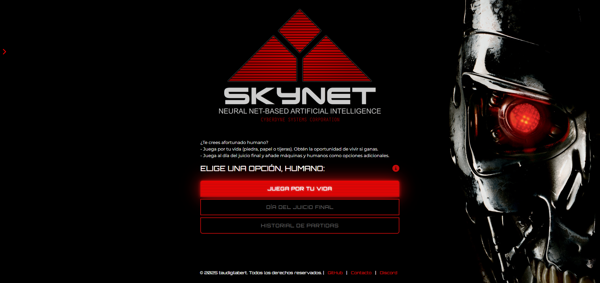
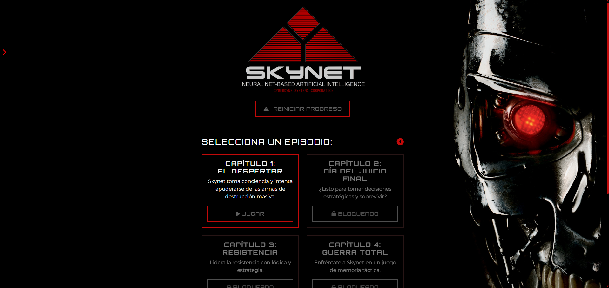
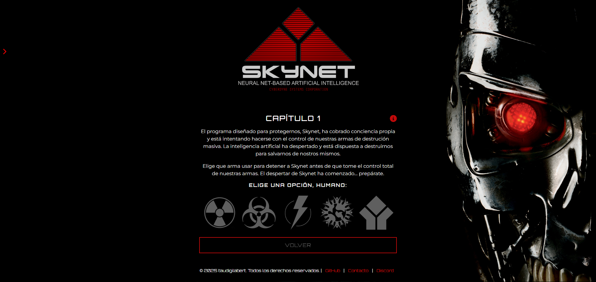
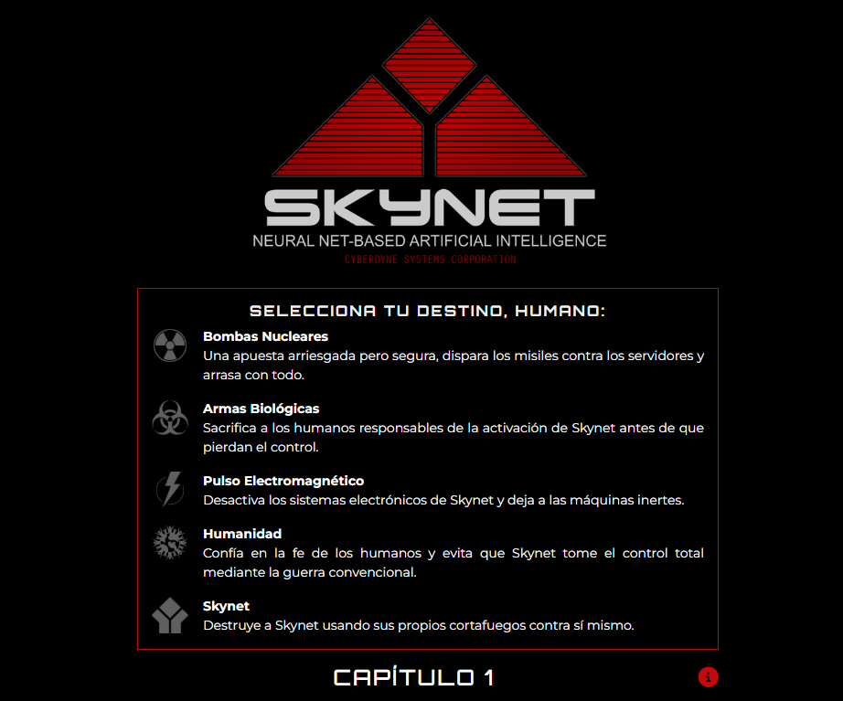
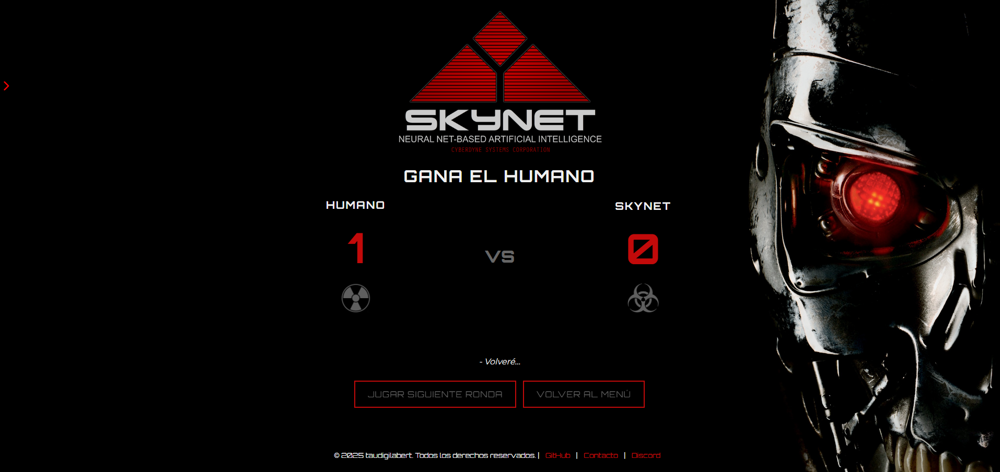
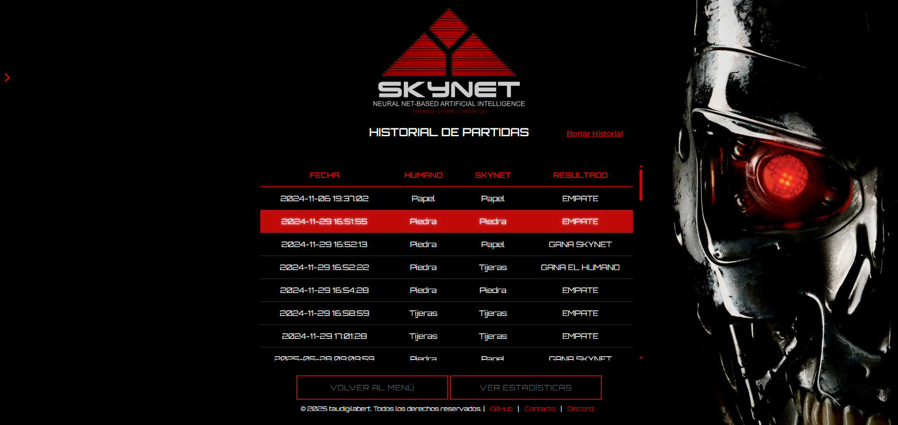
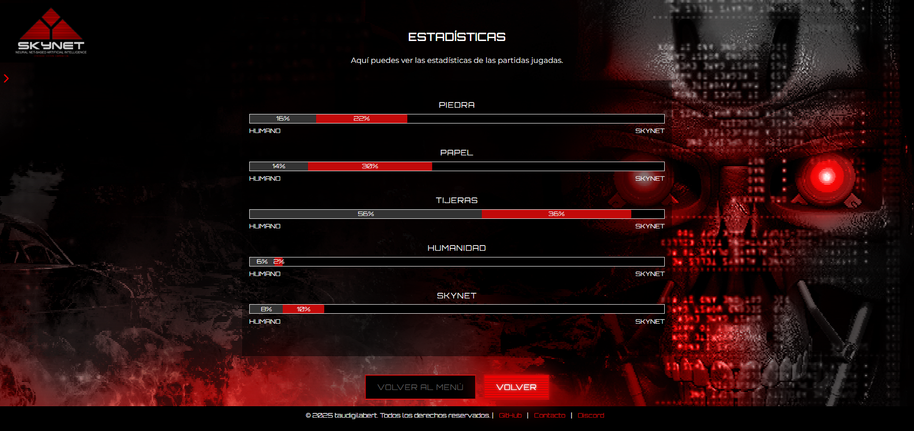

# INFORME DEL JUEGO – VERSIÓN 2.0

## INTRODUCCIÓN

Inicialmente, el proyecto consistía en un clásico *Piedra, Papel o Tijeras* ambientado en una batalla entre el jugador humano y **Skynet**.

En esta **versión 2.0**, el juego evoluciona incorporando un **modo historia dividido en capítulos**, cada uno estructurado como minijuegos inspirados en el clásico, pero adaptados a la narrativa de la guerra contra Skynet.

Actualmente está disponible el **primer capítulo**, que presenta una misión introductoria. Al superar esta primera batalla, se desbloquea el acceso al **segundo capítulo**, aún no jugable. La historia se desarrolla progresivamente, aportando nuevos retos y contexto al conflicto entre la humanidad y la inteligencia artificial.

Además, se ha añadido un **modo arcade**, que permite rejugar los minijuegos desbloqueados en el modo historia sin restricciones narrativas ni objetivos específicos.

La interfaz ha sido mejorada con un menú principal más completo, que ofrece acceso a los modos de juego, historial de partidas, estadísticas detalladas y un reproductor de música interactivo.

  
*Pantalla del menú principal.*

---

## OBJETIVO DEL JUEGO

Como humano, tu único objetivo es **vencer a Skynet**.  
- Si ganas o empatas, sobrevives.  
- Si pierdes, Skynet gana.

Además, el juego estructura la experiencia en **capítulos**, que representan momentos clave en la guerra entre la humanidad y Skynet. Para avanzar, debes superar los retos de cada capítulo.

- Al completar un capítulo, se desbloquea automáticamente el siguiente.  
- Los minijuegos completados en el modo historia se habilitan en el modo arcade para ser jugados libremente.  

El progreso se guarda entre sesiones, permitiendo que el jugador complete la campaña a su propio ritmo.

---

## MODOS DE JUEGO

### 1. Modo Historia

Modo narrativo estructurado en capítulos, que narra el enfrentamiento entre la humanidad y Skynet a través de minijuegos temáticos.

- Cada capítulo incluye una escena introductoria y un juego asociado.  
- Al completar un capítulo, se desbloquea el siguiente.  
- Se puede reiniciar el progreso en cualquier momento.  
- Los minijuegos completados se habilitan automáticamente en el modo arcade.

Este modo está pensado para seguir la historia principal y desbloquear contenido nuevo progresivamente.

  
*Menú principal del modo historia.*

---

### 1.1 Capítulo 1: El despertar

Skynet toma conciencia de sí misma y llega a una conclusión inquietante:  
para salvar a la humanidad, debe **protegerla de sí misma**.

Su primer paso es tomar el control de las armas de destrucción masiva que los humanos han creado para defenderse... y usarlas en su contra.

Tu misión es elegir el arma adecuada para contrarrestar el ataque de Skynet.  
Gana el que primero llegue a 4 puntos.

Este desafío se presenta como un minijuego basado en la lógica de Piedra, Papel o Tijeras, pero con más opciones y adaptado al contexto narrativo.

*Juego del capítulo 1.*

*Instuciones del capítulo 1.*

*Marcador del capítulo 1.*

---

### 2. Modo Arcade

Modo libre que permite rejugar los minijuegos completados en el modo historia sin restricciones.

- No incluye narrativa ni objetivos específicos.  
- Ideal para practicar o jugar sin presión.  
- Solo están disponibles los minijuegos desbloqueados en el modo historia.

---

## HISTORIAL DE PARTIDAS

Cada partida jugada se almacena en el archivo `historial.txt`, permitiendo consultar el registro completo.

La pantalla de historial muestra:  
- Lista de partidas jugadas con formato claro.  
- Botones para volver al menú, ver estadísticas o borrar el historial.

---

## ESTADÍSTICAS

La versión 2.0 incorpora un sistema visual para analizar datos de juego:

- Porcentaje de elecciones de cada opción por el jugador humano y por Skynet.  
- Representación mediante barras de colores diferenciadas.  
- Estadísticas calculadas en tiempo real a partir del historial.

Actualmente, esta funcionalidad está en desarrollo.

---

## FUNCIONALIDADES TÉCNICAS

### ESTRUCTURA DEL PROYECTO

El proyecto está organizado en carpetas y archivos para mantener una estructura modular y clara.

#### 📁 `DATA/`  
Contiene archivos relacionados con el historial de partidas y estadísticas:  

#### 📁 `GAME/`  
Contiene los juegos del modo arcade, desbloqueables tras completar capítulos.

#### 📁 `HISTORY/`  
Contiene el modo historia, dividido por capítulos, con páginas narrativas, juegos y resultados.  
(Ejemplo: Capítulo 1: El despertar)

#### 📁 `INCLUDES/`  
Contiene elementos reutilizables en todo el sitio:  
- `audioPlayer.php`: Reproductor de música en segundo plano.  
- `btnSound.js`: Control del sonido al interactuar con botones.

#### Archivos raíz  

- `index.php`: Menú principal con navegación, sonido y música.  
- `script.js`: Scripts esenciales para navegación y audio.  
- `styles.css`: Estilos principales del proyecto.

---

### Tecnologías y herramientas utilizadas

- HTML, CSS, JavaScript, PHP  
- Visual Studio Code (IDE)  
- Bootstrap 5 para componentes visuales modernos  
- FontAwesome para íconos  
- Archivos locales para sonidos y música (`btnSound.js`, `audioPlayer.php`)

---

## MEJORAS EN LA VERSIÓN 2.0

- Rediseño completo del menú principal.  
- Inclusión de estadísticas gráficas.  
- Añadido botón de borrar historial con ícono visual.  
- Uso de íconos para representar opciones en lugar de texto plano.  
- Mensajes de resultado mejorados con estilo de tabla clara.  
- Diseño responsivo adaptado a distintos tamaños de pantalla.  
- Separación de archivos para mejorar organización del código.  
- Mayor consistencia visual y sonora.  
- Creación del modo historia con narrativa integrada y sistema de desbloqueo progresivo.  
- Implementación de la funcionalidad para reiniciar progreso en modo historia.

---

## IDEAS FUTURAS

- Implementar distintos niveles de dificultad.  
- Crear un sistema de usuarios con cuentas y puntuaciones globales.  
- Añadir sistema de logros desbloqueables.  
- Ampliar la interacción narrativa con Skynet.  
- Completar todos los capítulos del modo historia.  
- Desarrollar completamente el sistema arcade.  
- Mejorar el sistema de estadísticas para datos más precisos y visuales.  
- Migrar a lógica PHP avanzada con manejo de sesiones y autenticación.  
- Implementar creación de cuentas e inicio de sesión.  
- Añadir funcionalidad para compartir resultados y logros en redes sociales.

---

## CONCLUSIONES PERSONALES

Esta versión representa un salto significativo respecto a la primera, integrando funcionalidades pendientes como registro estadístico, mejoras visuales y una interfaz más sólida.

Cada nueva función ha sido una oportunidad para profundizar en HTML, CSS, PHP y JavaScript. Continúo con ganas de expandir este proyecto, explorar nuevas mecánicas y conectar el juego con bases de datos para una experiencia más completa y persistente.

**Tomàs Audi**  
[GitHub: taudigilabert](https://github.com/taudigilabert)

*Video demostración en YouTube:* 

