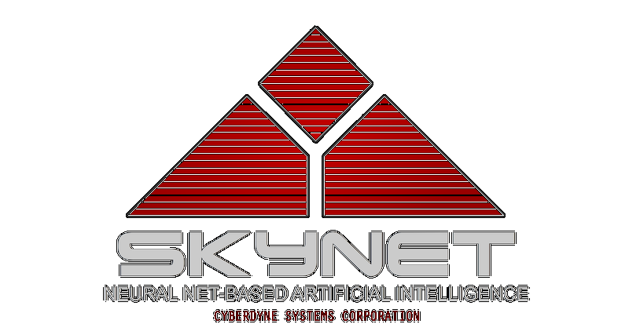

# INFORME DEL JUEGO

## INTRODUCCIÓN
Juego de piedra, papel o tijeras, pero en una versión en la que tú, como humano, juegas contra Skynet. Se basa en un menú con 4 opciones: 2 modos de juego, historial de partidas y la opción de reproducir o pausar música.  

#### Modos de juego:
 - **Juega por tu vida**:
   - Enfréntate a Skynet en el clásico juego de piedra, papel o tijeras.
    
 - **Día del juicio final**:
   - Igual que "Juega por tu vida", pero añadiendo como opciones la Humanidad y Skynet.

## OBJETIVO DEL JUEGO
Como humano, tu objetivo en el juego es vencer a Skynet. Es fácil: si ganas o empatas, vives; si pierdes, mueres.

## REGLAS DEL JUEGO
Las reglas son muy simples: el humano escoge una opción, y Skynet elige otra. En ambos modos de juego, las normas son las mismas, pero hay una variación en "Día del juicio final", ya que se añaden 2 elecciones.

- **Juega por tu vida:**
  - Piedra vence a Tijeras.
  - Tijeras vence a Papel.
  - Papel vence a Piedra.
   
  
- **Día del juicio final:**
  - **Piedra**:
    - Gana a Tijeras.
    - Pierde ante Papel.
    - Empata con Piedra.

  - **Papel**:
    - Gana a Piedra.
    - Pierde ante Tijeras.
    - Empata con Papel.
  
  - **Tijeras**:
    - Gana a Papel.
    - Pierde ante Piedra.
    - Empata con Tijeras.

  - **Humanidad**:
    - Gana a Skynet.
    - Pierde ante Piedra.
    - Empata con Humanidad.

  - **Skynet**:
    - Gana a Tijeras.
    - Pierde ante Papel.
    - Empata con Skynet.

## ESTRUCTURA DEL JUEGO
El juego utiliza como menú un documento HTML, a partir del cual se crean 3 archivos PHP.
#### Menú
- **index.html:**
  Documento HTML donde se encuentran las 4 opciones a elegir. Cada botón redirige a su archivo correspondiente, excepto el botón de reproducción, que ejecuta la función de reproducción o pausa de la música. Estos botones, además de redirigir, emiten un sonido al pasar por encima.  
  **(Es necesario interactuar con la web, como hacer clic en cualquier parte, para activar el sonido de los botones al pasar por encima)**  
  
   

#### Juega por tu vida

- **game.php:**
  Corresponde a la primera pantalla de "Juega por tu vida". Este contiene un formulario donde se muestran las distintas opciones para el jugador.  
  
   
  
- **game1resultados.php:**
  Aquí se ejecuta la lógica del juego. Se muestra el resultado y las opciones de ambos bandos, además de una frase que nos dedica Skynet acorde al resultado. En la parte inferior del tablero de resultados tenemos 2 botones: volver a jugar, que nos devuelve a la elección de opciones, y volver al menú.  
  
   

#### Día del juicio final

- **game2.php:**
  Corresponde a la primera pantalla de "Día del juicio final". Este contiene un formulario donde se muestran las distintas opciones para el jugador, incluyendo las dos opciones adicionales de Humanidad y Skynet.  
  
   

- **game2resultados.php:**
  Aquí se ejecuta la lógica del juego. Se muestra el resultado y las opciones de ambos bandos, además de una frase que nos dedica Skynet acorde al resultado. En la parte inferior del tablero de resultados tenemos 2 botones: volver a jugar, que nos devuelve a la elección de opciones, y volver al menú.  
  

#### Historial de partidas

- **data.php:**
  Este archivo está estructurado como un HTML y tiene lógica PHP que lee e imprime los datos registrados en el documento historial.txt, mostrando el historial de partidas registradas. Se basa en un título y un registro. Debajo de esto hay 3 botones: volver al menú, ver estadísticas y borrar historial.  
  
   

- **estadisticas.php:**
  Primero se inicializan 4 variables: 
  - "opciones": un array con las 5 opciones posibles. 
  - "humanoOpciones": un array con las 5 opciones inicializadas a 0.
  - "skynetOpciones": un array con las 5 opciones inicializadas a 0.
  - "totalPartidas": inicializada en 0.  
  
  Se hace una lectura línea por línea y se cuentan las opciones que aparecen. Cada línea leída suma +1 a la variable totalPartidas, y se muestran los resultados obtenidos.  
  

#### DESARROLLO
- **IDE:** Visual Studio Code
- **Lenguajes:** PHP, JavaScript, HTML, CSS
  
#### DESAFÍOS EN EL PROYECTO
- Música en el menú.
- Efecto de sonido en los botones del menú.
- CSS con múltiples estilos de etiqueta, id y clases.
- Estructura de los archivos del juego.
- Uso de íconos como opciones en el formulario.
- Disposición de los elementos al mostrar los resultados.
- Registro de partidas jugadas y almacenamiento en historial.txt.
- Lectura de fichero línea por línea e impresión de los resultados.
- Opción de borrar registros en el historial.

#### IDEAS A FUTURO
- Añadir efectos de sonido en el resto de botones del juego.
- Reproducción continua de la música a través de las distintas ventanas del juego.
- Añadir botón de mute, play y pause en todas las pantallas del juego.
- Creación de un modo de juego por vidas.
- Implementación de distintos modos de juego.
- Implementación de diferentes imágenes según el resultado de las partidas.

#### CONCLUSIONES PERSONALES
He invertido muchas horas haciendo prueba y error, buscando información por internet, tutoriales y consultando a ChatGPT. Me lo he pasado muy bien creándolo y añadiendo detalles como la música y el sonido, así como diseñando la interfaz del juego y su CSS. Hay varias cosas que me gustaría volver a hacer de nuevo o reorganizar, además de añadir seguramente más modos de juego o juegos distintos contra Skynet. Lo más seguro es que siga trabajando en ello en el futuro.
 
 
Tomas Audi